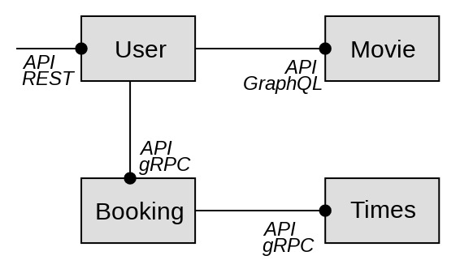

# UE-AD-A1-TP

## 1. Introduction

This TP is a part of the course "Architecture Distribuée" at IMT ATlantique. 
The goal of this TP is to implement some microservices in order to understand the main concepts of microservices architecture.
There are 4 microservices in this TP:
- **Movie**: This microservice is responsible for managing movies. It has a GraphQL API to create, update, delete and get movies.
- **Booking**: This microservice is responsible for managing bookings. It has a gRPC API to create and get bookings.
- **Showtime**: This microservice is responsible for managing showtimes. It has a gRPC API to get showtimes for a booking.
- **User**: This microservice is responsible for managing users. It has a REST API get users, get user bookings and film information for a booking.

## 2. Architecture



## 3. How to run

### 3.1. Requirements

- Docker
- Docker-compose

### 3.2. Run

```bash
docker-compose up
```